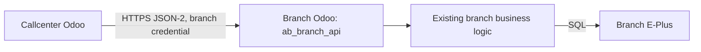

# Callcenter and Branch API: JSON-2 Setup and Operations

## Architecture



Each branch runs its own Odoo server and database. Credentials belong to a service user in that branch database; callcenter operators do not need accounts in every branch. Store access remains explicit, including for administrators using other provider methods.

Stock comes from branch E-Plus `Item_Class_Store`, filtered by store and product. Branch Odoo is the intermediary. Product catalogue search in callcenter remains local; the provider also exposes a branch product search method. Transfers are not implemented.

**This release uses JSON-2 only.** Old XML-RPC passwords are not reused as API keys. Existing connections require enrollment. Upgrade branches before switching the callcenter process; enroll every branch required for operations before cutover.

## Workspaces and runtime

| Setting | Branch | Callcenter |
|---|---|---|
| Addons workspace | `/opt/odoo19/custom-addons` | `/opt/odoo19/worktrees/callcenter` |
| Changed module | `ab_branch_api` | `ab_sales` |
| Local database | `abdin_pos` | `callcenter19` |
| Configuration | `/opt/odoo19/odoo19-pos.conf` | `/opt/odoo19/odoo19-callcenter.conf` |
| Local HTTP / gevent ports | `4092` / `4093` | `5066` / `5067` |

Use the branch HTTP address, not its gevent port or E-Plus SQL address. For different servers, use a reachable HTTPS hostname. HTTP is permitted only for loopback development. TLS verification stays enabled and redirects are rejected.

Targeted upgrades:

```bash
/opt/odoo19/venv19/bin/python /opt/odoo19/server/odoo-bin \
  -c /opt/odoo19/odoo19-pos.conf -d abdin_pos \
  -u ab_branch_api --stop-after-init --no-http --max-cron-threads=0

/opt/odoo19/venv19/bin/python /opt/odoo19/server/odoo-bin \
  -c /opt/odoo19/odoo19-callcenter.conf -d callcenter19 \
  -u ab_sales --stop-after-init --no-http --max-cron-threads=0
```

For a new branch, use `-i ab_branch_api` instead. Restart the affected Odoo processes afterward. Never use `-u base` for this feature.

## Prepare each branch once

1. Install/upgrade Branch API. It declares the native `rpc` module dependency required for JSON-2.
2. Verify existing E-Plus/replica configuration, the default sales store, and employee, contract, promotion, and product mappings. The API does not configure these business settings.
3. Create or choose an active internal **service user**, without Settings administrator access. Assign **Branch API / API User** and the business roles needed for the intended operations through Odoo's user security screens. The API group alone does not grant all business ACLs.
4. As an administrator, open **Sales → Configurations → Branch API → Prepare Callcenter Connection**.
5. Select the service user and store. Enable **Allow Posting** for sale submission and return posting; enable **Allow Cost** only if required. Stock cost is masked otherwise.
6. Acknowledge **Enable database-wide programmatic API key management**. This sets `base.enable_programmatic_api_keys`; it applies to all eligible users in that database, not only this connection. The API User group allows a maximum 90-day key lifetime. Odoo's native key-count limit remains in effect. [more info](#enable-database-wide-programmatic-api-key-management)
7. Generate the credential. Copy it once into callcenter. The wizard does not save plaintext in its database record; the secret exists in the response/browser while the dialog is open. Odoo stores its hash.


The wizard creates or updates the selected **Branch API → Access** binding. Maintain other user/store bindings on that screen. Use a distinct service identity per independently managed connection; never use one chain-wide shared secret.

## Enroll in callcenter

Open **Sales → Configurations → Branch Connections** as a Settings administrator.

| Field | Configuration |
|---|---|
| Store | Local store with the same E-Plus serial as the branch |
| Branch Odoo URL | Branch HTTPS base URL, without `/json/2` or other paths |
| Branch Database | Branch PostgreSQL database name |
| API Key | One-time credential from the branch wizard |
| Responsible Administrator | Active Settings administrator who receives connection activities |
| Connection Timeout | Per-request timeout, 3–120 seconds |
| Push to E-Plus on Submit | Controls immediate posting of sales; returns always post immediately |
| Active | Enables use and scheduled management; disabling does not revoke the remote credential |

Callcenter encrypts active, pending, and previous credentials using the existing `decryption_key` configuration. Keep that key stable and protected. Secret fields are administrator-only, masked in the UI, and excluded from export. Never put credentials in Git, screenshots, logs, or command-line arguments.

Click **Test Connection**. Success verifies native bearer authentication, provider version, the store binding, the service user's identity, credential expiry, and programmatic key management. It records **Ready** and the verified integration login. A failed check persists its message and creates an administrator activity; inspect the form after the button completes.

A successful check does not prove E-Plus connectivity, stock availability, contract configuration, or posting readiness. Confirm those independently before a business transaction. Callcenter group access and employee session rules still apply locally.

## Central monitoring and rotation

The list shows health, last successful check, enrollment state, expiry, and rotation state. Select connections for **Check Connections** or **Rotate Credentials**; these bulk actions enqueue background jobs.

This workspace already uses **integration_queue_job**, which provides `queue.job` and `with_delay`. Do not install the separate `queue_job` addon alongside it: both own the same model tables and root channel.

The callcenter configuration must load the installed runner. The local configuration has been adjusted to:

```ini
[options]
server_wide_modules = web,integration_queue_job

[queue_job]
channels = root:7,root.sync_live:2,root.sync_historical:1,root.branch_connections:4
```

Preserve other required server-wide modules and existing channels on each deployment. The added channel can run four management jobs; database advisory locks also cap management execution at four concurrent jobs per callcenter database and serialize jobs per connection. The root capacity must accommodate the existing work plus the desired management capacity. A single-process runner may use less capacity.

- Health scheduler: every **15 minutes**, checks provider capabilities and credentials only.
- Rotation scheduler: daily, considers keys with **30 days or less remaining** and unfinished rotations.
- Key lifetime: **90 days**.
- Overlap: at least **24 hours** after a replacement passes verification. Retirement runs at the next rotation job after that threshold.
- Administrator activities flag failed checks, approaching expiry, interrupted generation, and management failures. Activities are deduplicated per connection and closed when the warning clears.

| Rotation state | Meaning |
|---|---|
| Idle | No replacement is pending |
| Generating | Durable marker written before remote key generation |
| Verification Pending | Replacement stored encrypted; the old key remains active until verification succeeds |
| Overlap | New key is active; old key retained temporarily |
| Needs Review | Generation response was uncertain or the worker stopped during generation; automatic generation is blocked |

The replacement must authenticate as the same integration user and pass the same store checks. The old key is revoked only after another successful check with the replacement. Failed retirement retains the previous key for retry. Scheduled jobs never retry business sale or return submission.

For **Needs Review**, inspect the branch user's API keys using the recorded Rotation Name, reconcile any generated key, then enroll a fresh credential through the wizard. An expired or revoked active key also requires fresh enrollment. Do not repeatedly create keys to work around a branch outage.

**Revoke Credential** is an explicit form action available when rotation is idle. It revokes the current remote key and disables the local connection after success. If the branch cannot be reached, revocation is not marked complete. For emergency access removal, disable the connection locally and revoke credentials at the branch. During an unfinished rotation, reconcile all associated keys at the branch first.

## Sale, stock, and return workflow

### Sales

1. The employee builds the bill in callcenter. Live stock requests go through the selected branch.
2. Callcenter converts local records into stable external references and submits the existing request token.
3. Branch Odoo validates access, resolves its own records, creates the sale, and runs its existing pricing and promotion logic. Computed contract display values (`company_pay`, `cust_pay`, `contract_name`) are omitted from the request; the contract reference and discount input remain.
4. With immediate posting disabled, the branch sale stays `prepending`. With posting enabled, existing branch logic writes to E-Plus and returns the invoice ID, normally with `pending` status.
5. Existing branch synchronization marks the invoice `saved` when E-Plus finalizes it. API operation **Done** does not itself mean the invoice is finalized.

### Returns

1. Enter the original E-Plus invoice ID in callcenter and load lines through the branch API.
2. Branch Odoo checks ownership and creates/reuses its return draft. Return previews and installed contract/promotion repricing run on the branch.
3. Callcenter submits selected original-line quantities and the available employee reference using a stable return token.
4. Branch Odoo requires the original invoice to be finalized, checks the return period and quantities, and runs its existing E-Plus return, financial, and replication logic.
5. Successful responses update callcenter with the branch return ID, E-Plus return ID, financial ID, and totals.

The sale immediate-posting option does not defer returns. Loading a return may create an Odoo draft but does not post an E-Plus return. Callcenter users cannot bypass the API with direct sale/return SQL connections.

### Mapping and retry safety

Match stores/products/customers using E-Plus identifiers, supported codes, or shared XML IDs. Employees use cost-center codes; units use product category and factor. Promotions without stable external serials require shared XML IDs. Numeric Odoo IDs are never cross-database identities.

The existing branch sales helper includes a default-store server override for `192.168.1.150`; verify that existing business configuration before deployment.

Business operation states and request tokens are independent of credential rotation:

- Completed unchanged requests return the stored result.
- Changed payloads cannot reuse completed tokens.
- Processing or uncertain E-Plus outcomes require reconciliation before any further posting.
- SQL and Odoo PostgreSQL do not form one atomic transaction. Partial E-Plus identifiers are retained for investigation.
- Do not create a new token or switch integration users to bypass an uncertain business operation.

Inspect **Branch API → Operations** on the branch and **Callcenter RPC Logs** in callcenter. The retained log/model technical names do not indicate XML-RPC transport. Administrator return forms show the branch return ID and token.

## JSON-2 interface

All requests use native Odoo bearer authentication:

```text
POST /json/2/ab_branch_api/<method>
Authorization: bearer <secret>
X-Odoo-Database: <branch database>
Content-Type: application/json
```

Arguments are named JSON properties, for example `{"store_serial": 29}`. Do not send XML-RPC positional argument envelopes.

Business methods remain `get_capabilities`, `search_products`, `get_stock_lines`, `submit_sale`, `get_return_invoice`, `submit_return`, and `get_operation_status`. `get_connection_status(store_serial)` adds the authenticated user's identity and credential metadata. `revoke_credential(store_serial, key)` safely retires the current user's credential and tolerates an already invalid old key.

Rotation uses native `/json/2/res.users.apikeys/generate` with `key`, `scope`, `name`, and `expiration_date`. Metadata is scoped to the authenticated user; branch storage never exposes key hashes. Normal branch validation/access messages appear as Odoo messages; unexpected responses are sanitized.

## Deployment automation guide

The wizard is the default enrollment path. For a future deployment tool managing many servers:

1. Inventory each branch's HTTPS URL, PostgreSQL database, store serial, service-user login, and administrator owner. Keep secrets outside this inventory.
2. Deploy and target-upgrade `ab_branch_api`; configure TLS and the existing E-Plus business settings.
3. Provision users and roles through approved Odoo security administration. Do not add Python hooks or ad-hoc group-membership writes to the addon.
4. Run the enrollment workflow in the authenticated branch administration context. Its model is `ab_branch_api_enrollment`, and `action_generate()` returns the one-time credential in the action context. An unattended tool needs its own securely bootstrapped administrative access; it cannot use a nonexistent service credential to enroll itself.
5. Transfer the returned credential through a secret manager or protected in-memory channel. Do not print the action response, place the secret in shell arguments, or save it in plaintext files.
6. Configure the callcenter record through Odoo ORM/admin access, using the write-only `api_key` input, then run `action_test_connection()` and require Ready plus a successful test.
7. Verify the installed queue runner, both scheduled actions, and a successful management job before enabling business use. Record only non-secret verification results.
8. For interrupted enrollment, inspect branch keys and the central state before retrying. Remove only obsolete credentials using Odoo's supported key controls; never alter business records to repair enrollment.

No deployment platform, chain-wide credential, or automatic trust bootstrap is bundled with this module.


## Enable database-wide programmatic API key management
That checkbox enables Odoo’s automatic API-key creation and revocation, which callcenter needs to renew its credentials without someone visiting each branch.

  For example, when a branch key has 30 days remaining:

  1. Callcenter authenticates using the current key.
  2. It asks branch Odoo to generate a replacement for the same integration user.
  3. It verifies the replacement and starts using it.
  4. After the overlap period, it revokes the old key.

  “Database-wide” describes who can use that feature. The setting belongs to the entire branch Odoo database. Other eligible users with valid credentials can also use Odoo’s programmatic key-
  management methods. It is not restricted to ab_branch_api.

  It does not automatically grant users access to Branch API, other stores, or sales posting. Those still require the API role, an explicit user/store binding, and the appropriate business
  permissions. Each of your 60 branch databases has its own setting.

  The two limits serve different purposes:

   Limit              Meaning
  ━━━━━━━━━━━━━━━━━  ━━━━━━━━━━━━━━━━━━━━━━━━━━━━━━━━━━━━━━━━━━━━━━━━━━━━━━━━━━━━━━━━━━━━━━━━━━━━━━━━━━━━━━━━━━━━━━━━━━━━━━━━━━━━━━━━━━━━━━━━━━━━━━━━━━━━━━━━━━━━━━━━━━━━━━━━━━━━━━━━━━━━━━━━━━━━━━━━━━
   90-day lifetime    Our integration group permits keys lasting up to 90 days, and enrollment/rotation requests that lifetime. Another higher-privilege group could permit longer durations.
  ─────────────────  ──────────────────────────────────────────────────────────────────────────────────────────────────────────────────────────────────────────────────────────────────────────────────
   Key-count limit    The installed Odoo code defaults to 10 unexpired keys per user for programmatic creation, configurable through base.programmatic_api_keys_limit. This prevents unlimited key
                      accumulation.

  Normally, our connection uses one key, temporarily two during rotation, so it stays comfortably below that count limit.

  The acknowledgment makes this broader database setting explicit. If you do not want other eligible users to gain programmatic key management, we should change the design to restrict renewal to the
  dedicated integration users instead of enabling this global switch.

