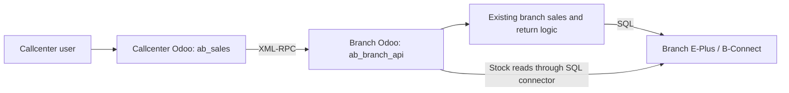

# Callcenter and Branch API: Process and Configuration

Implementation reference, checked against the workspaces on 2026-09-08.

## 1. Architecture and scope



XML-RPC connects **Odoo to Odoo**. Branch Odoo uses the existing SQL connector to communicate with E-Plus.

| Operation | Current behavior |
| --- | --- |
| Callcenter POS sale submission | Sent to branch Odoo; the sale configuration controls immediate E-Plus posting. |
| Return invoice loading and refund previews | Handled by branch Odoo using the original E-Plus invoice and branch business rules. |
| Return posting | Sent to branch Odoo and immediately posted to E-Plus after validation. |
| Live stock batches and POS balance refresh | Read from branch E-Plus through branch Odoo. |
| POS catalogue search | Uses the existing callcenter catalogue. The provider separately exposes a product-search endpoint. |
| Other branch operations, including transfers | Not implemented in this API version. |

`Item_Class_Store` is an **E-Plus SQL Server table**, not an Odoo table. Branch Odoo reads its branch-filtered batch rows and returns structured inventory data. The new stock endpoint does not update Odoo inventory snapshots or product prices. Existing local catalogue/snapshot information remains separate from live stock reads.

Callcenter routing applies to Odoo users in `ab_sales.group_call_center`. Other users retain the existing local flow. Direct sale pushes and direct return SQL connections are blocked for callcenter users by the client adapter.

## 2. Workspaces and local instances

These are the development configuration values at the time of writing; verify them before running commands in another environment.

| Setting | Branch / pos19 workspace | callcenter19 workspace |
| --- | --- | --- |
| Addons directory | `/opt/odoo19/custom-addons` | `/opt/odoo19/worktrees/callcenter` |
| Main change | New `ab_branch_api` module | Updated `ab_sales` |
| Configuration file | `/opt/odoo19/odoo19-pos.conf` | `/opt/odoo19/odoo19-callcenter.conf` |
| PostgreSQL database | `abdin_pos` | `callcenter19` |
| HTTP port | `4092` | `5066` |
| Gevent port | `4093` | `5067` |

Keep the databases separate. HTTP and gevent must also use different ports when Odoo runs separate listeners. The **Branch Odoo URL** uses the HTTP port, not the gevent port or the E-Plus SQL Server address.

## 3. Prepare the branch

1. Install `ab_branch_api` on the **branch Odoo database**. It depends on `ab_sales` and `ab_hr`; keep the relevant contract, promotion, and employee extensions installed for the branch's business flows.
2. Verify the branch's existing replica configuration, default sales store, E-Plus connection, and employee mappings. Installing the API does not configure E-Plus or synchronize master data.
3. Confirm that the target store has the correct E-Plus serial and server configuration. The existing connection helper normally uses `store.ip1`; it retains the `192.168.1.150` override for the configured default sales store. Check that this matches the deployment.
4. Choose the branch Odoo integration user. In Settings, grant **Branch API / API User**, together with the business access needed for sales, returns, products, and employee references. The API group alone does not grant all business permissions.
5. As an administrator, open **Sales → Configurations → Branch API → Access** and add the binding below.

| Field | Value or purpose |
| --- | --- |
| Active | Enabled. |
| User | The branch integration user whose credentials callcenter will use. |
| Store | The permitted branch store. |
| Allow Posting | Enable to accept sale and return submissions. |
| Allow Cost | Enable only if this integration user should receive cost information. |

An explicit active user/store binding is required **even for a Settings administrator**. A user may have multiple explicit bindings if that access is intended. When cost access is disabled, stock/return responses mask cost as `0.0`; this is not evidence that the actual cost is zero.

Configure group membership through Odoo Settings/security configuration, not through Python scripts. Creating the access binding does not add the user to the API group automatically.

### Module installation or upgrade

For a new branch installation:

```bash
/opt/odoo19/venv19/bin/python /opt/odoo19/server/odoo-bin \
  -c /opt/odoo19/odoo19-pos.conf -d abdin_pos \
  -i ab_branch_api --stop-after-init \
  --workers=0 --max-cron-threads=0 \
  --http-port=5069 --gevent-port=5072
```

For an existing installation, replace `-i ab_branch_api` with `-u ab_branch_api`. These alternate ports isolate maintenance from the PyCharm instance; choose another unused pair if necessary.

## 4. Prepare callcenter

1. Upgrade `ab_sales` in the callcenter database using the callcenter configuration file and worktree.
2. Verify that the callcenter configuration has a valid `decryption_key`. This key encrypts/decrypts the stored branch RPC password/API key and optional sync key. Keep it stable; changing it can make existing stored secrets unreadable. Never put real secrets in this document or Git.
3. Give the intended callcenter Odoo users the **Abdin Sales / Call Center** role.
4. With `ab_employee_access_sales` installed, configure employee POS sessions, permitted stores, and the employee role's return-screen permission. Call Center membership does not replace these checks. Existing store service-user restrictions still apply.
5. As an administrator, open **Sales → Configurations → Branch RPC Configurations** and create one active configuration for each target store.

| Field | What to enter |
| --- | --- |
| Store | The callcenter store representing the target branch. Its E-Plus serial must match the branch store. |
| Branch Odoo URL | Reachable base URL of branch Odoo, without `/xmlrpc/2/object`. For the same-host development setup: `http://127.0.0.1:4092`. On another host/container, use an address reachable from the callcenter server; use HTTPS for deployed network access. |
| Branch Database | The branch PostgreSQL database, such as `abdin_pos`, not `callcenter19` and not the E-Plus database name. |
| RPC User | Login of the branch integration user configured in step 3. |
| RPC Password/API Key | That user's branch Odoo password or supported API key. |
| RPC Sync Key | Optional `x-sync-key` value, only when the branch deployment requires it. |
| Connection Timeout | Socket timeout in seconds; default `15`. A timeout does not prove that posting failed. |
| Push to E-Plus on Submit | Controls **sales only**. Returns always request immediate posting. |

The configuration enforces one record per store. Reuse or reactivate the existing record rather than creating a duplicate for that store.

Upgrade command:

```bash
/opt/odoo19/venv19/bin/python /opt/odoo19/server/odoo-bin \
  -c /opt/odoo19/odoo19-callcenter.conf -d callcenter19 \
  -u ab_sales --stop-after-init \
  --workers=0 --max-cron-threads=0 \
  --http-port=5070 --gevent-port=5073
```

Use targeted upgrades, never `-u base`. During the original setup, an older promotion schema also required a targeted `ab_promo_program` upgrade because a report expected `compensation_company_id`. This is a historical deployment issue, not a required upgrade for every installation.

Restart both PyCharm-managed Odoo instances after applying code/upgrades. Maintenance commands do not reload the Python classes already held by those processes.

## 5. Test the connection and master-data mapping

Click **Test Connection** on each callcenter Branch RPC Configuration. It authenticates to branch Odoo and calls `ab_branch_api.get_capabilities()` to verify API version `1`, the requested store, and access to that store.

A successful test establishes access to the **branch Odoo API**. It does not prove E-Plus connectivity, posting permission, employee mapping, or that all business references exist. Verify those separately before a real transaction.

Cross-database mapping uses:

| Data | Reference |
| --- | --- |
| Store | E-Plus store serial (`sto_id`). |
| Product and other supported master records | E-Plus serial or code; shared XML ID where applicable. |
| Employee | Cost-center code when available. |
| Product unit | Unit factor within the mapped product's unit category. |
| Original return invoice | E-Plus invoice number (`sth_id`) within the selected store. |
| Return line | Original detail ID (`std_id`) plus product serial; quantities travel in source-invoice units. |
| Promotion or another record without a serial/code | A shared XML ID that resolves on the branch. |

Do not assume the same numeric Odoo record ID refers to the same record in both databases. Missing or ambiguous references are rejected. The API does not automatically import missing products, employees, contracts, or promotions.

For a non-posting check, load live stock/product details and confirm the selected store. Loading a return reads E-Plus data and can create a branch Odoo return draft/operation record, but does not post an E-Plus return. A genuine sale/return test changes stock and possibly financial records; use a designated test environment or an explicitly approved business transaction.

## 6. Sale process

1. The callcenter employee creates a POS bill and selects a store.
2. Existing employee-session and POS checks run.
3. Callcenter records the submission attempt, converts references, and calls branch `submit_sale()` using the bill's request token.
4. Branch Odoo validates access, resolves its own records, creates the branch sale, and runs the existing business logic.
5. The configured push flag determines the outcome:

| Push flag | Result |
| --- | --- |
| Disabled | Branch Odoo creates a `prepending` invoice. This API call does not post it to E-Plus; branch staff use their existing workflow later. |
| Enabled | Branch Odoo calls the existing E-Plus posting method. Successful posting returns an E-Plus invoice ID and normally leaves the branch invoice `pending`. |

The existing branch status synchronization marks the sale `saved` when E-Plus finalizes it (`sth_flag = 'C'`). An API operation marked **Done** means that the requested API action completed; it does not necessarily mean E-Plus has finalized the sale.

Callcenter receives the remote invoice identifiers and records the RPC outcome. This submission path creates the invoice on branch Odoo, rather than creating a second local sale in callcenter.

## 7. Return process

1. Open a return for the selected store and original E-Plus invoice. Opening from an existing Odoo sale requires that sale to have an E-Plus serial.
2. Callcenter creates/reuses its local return and a stable request token, then asks branch Odoo to load the source invoice.
3. Branch Odoo creates/reuses the corresponding return draft and reads invoice lines from E-Plus. Callcenter displays mapped products, units, and returnable quantities.
4. The employee selects quantities. Refund previews run on branch Odoo, including installed contract/promotion repricing rules.
5. Clicking **Push to E-Plus** sends source-line identities, quantities in source units, notes, and the available employee reference to the branch.
6. Branch Odoo checks access, invoice ownership, finalized source status, return period, and quantities. It reuses the existing return-posting logic to update E-Plus stock, sales/return records, payments, and financial adjustments as applicable.
7. Existing return extensions perform the replication work. The branch returns its return ID, E-Plus return ID, financial transaction ID, and totals; callcenter updates its local return to `saved` after success.

A pending source sale cannot be returned. The sale **Push to E-Plus on Submit** setting does not defer return posting. A local return cannot simply switch to another invoice while reusing a token already tied to its branch return; create a separate return for a different invoice.

## 8. Logs, timeouts, and reconciliation

Use both views when investigating an operation:

- **Callcenter:** Sales → Configurations → Call-Center RPC Logs. Check the operation name, store, request token, remote identifiers, status, and error.
- **Branch:** Sales → Configurations → Branch API → Operations. Check the token, operation kind, state, branch record ID, result, and message.
- **Callcenter return form, administrator:** Branch Return ID and Branch Request Token are shown after a branch return ID is known.

| Branch operation state | Meaning and next action |
| --- | --- |
| Draft | Preparation/read stage; API posting has not been reserved. |
| Processing | Request was durably reserved before external posting. If it remains here after a failure, investigate; do not assume it is safe to repost. |
| Done | Requested action completed. Repeating the same token and payload returns its stored result. |
| Needs Reconciliation | The external outcome is uncertain. Automatic reposting is blocked. Inspect E-Plus and branch records first. |

A completed token cannot be reused with a different payload. Do not change the token, RPC identity, or create a replacement request to bypass an uncertain result.

The existing return posting, repricing, and replication steps do not all share one SQL commit. E-Plus may already contain the return when a later replication step fails. The API retains available partial identifiers and blocks replay; it does not automatically repair or reset uncertain operations. A return reservation can also block another API return for the same invoice until the outcome is reconciled.

If the response was lost after the operation completed, retrying the **unchanged** request can recover the stored result. If it is Processing or Needs Reconciliation, an administrator must investigate the branch/E-Plus state before deciding any further business action. The provider's `get_operation_status()` is scoped to the authenticated API user and requested store.

## 9. Troubleshooting

| Symptom | Check |
| --- | --- |
| No active branch RPC configuration | Correct callcenter database, selected store, and active configuration. |
| Branch API access required | Branch integration user's API User role or Settings access. |
| Branch operation not allowed | Active user/store binding; Allow Posting for submissions. |
| Unknown provider/model or version mismatch | Correct branch addons path, `ab_branch_api` installation/upgrade, database, and process restart. |
| Secret cannot be decrypted | The callcenter `decryption_key` must match the key used to store the secret. Restore the intended key or re-enter the credential through configuration. |
| E-Plus server not configured or unavailable | Branch store/server settings and SQL connectivity from the branch Odoo host. |
| Missing/ambiguous reference or unit | Matching master-data identifiers, shared XML IDs, employee cost-center codes, and product unit factors. |
| Employee login or return-screen access error | Callcenter employee session, role permission, allowed stores, and store service-user assignment. |
| Source invoice still pending | Finalize the source sale through the existing branch/E-Plus workflow first. |
| Different data for the same token | Inspect the original operation; do not force a new token to bypass the protection. |
| Return saved but replication failed | Reconcile using the recorded transaction IDs; do not repeat the stock return blindly. |

## 10. Provider interface and source references

All provider methods are on the branch model `ab_branch_api`, accessed through the configured Odoo XML-RPC endpoints. They are not direct E-Plus RPC methods.

| Method | Purpose |
| --- | --- |
| `get_capabilities(store_serial)` | Version, branch identity, posting capability, and supported methods. |
| `search_products(store_serial, query='', limit=60, offset=0)` | Query branch Odoo products; return stable identifiers and names. |
| `get_stock_lines(store_serial, product_serials)` | Return `{'data': [...]}` with live stock batches; maximum 200 product serials per request. |
| `submit_sale(store_serial, token, payload, push_to_eplus=True)` | Create the branch sale and optionally post it. |
| `get_return_invoice(store_serial, invoice, token, selections=False)` | Load/reuse a branch return and optionally apply selections for a preview. |
| `submit_return(store_serial, invoice, token, lines, notes='', employee_ref=False)` | Validate and post a return. |
| `get_operation_status(store_serial, token)` | Retrieve the caller's stored operation outcome. |

Stock rows include batch `source_id`, product/store E-Plus serials, `qty`, `qty_in_small_unit`, `price`, `cost`, and `exp_date`. The callcenter adapter maps local product/store IDs for `inventory_json` after validating the response.

Relevant sources:

- [Callcenter adapter](models/ab_sales_branch_api_client.py)
- [RPC configuration and connection test](models/ab_sales_branch_rpc_config.py)
- [POS sale submission](models/ab_sales_pos_api.py)
- [Administrator views](views/ab_sales_branch_api_views.xml)
- Branch provider: `/opt/odoo19/custom-addons/ab_branch_api/models/branch_api.py`
- [Implementation changelog](changelog.d/2026-09-07-branch-api-client.md)
