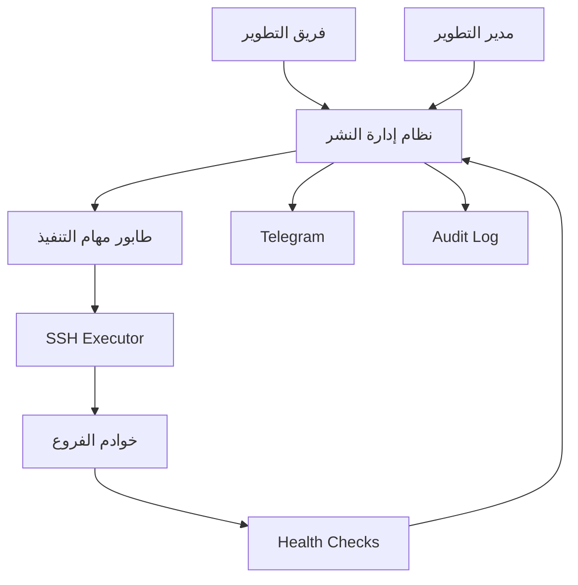

# خطة نظام إدارة التحديثات والنشر المركزي للفروع

## 1. الملخص التنفيذي

إنشاء نظام مركزي لإدارة دورة حياة التحديثات البرمجية ونشرها على خوادم الفروع. يعمل النظام من خادم داخل المجموعة لديه صلاحية SSH على الخوادم المستهدفة، ويتكامل مع بوت Telegram لإرسال الإشعارات والملخصات المهمة إلى **جروب عمليات التطوير**.

لا يقتصر النظام على تشغيل أوامر SSH، بل يدير العملية كاملة: تسجيل التحديث، مراجعته، طلب نشره، اعتماده، فحص الخوادم، التنفيذ على مراحل، التحقق من نجاحه، التراجع عند الحاجة، وتسجيل كل خطوة في سجل تدقيق دائم.

---

## 2. أهداف النظام

- توحيد تسجيل ومتابعة جميع التحديثات.
- معرفة حالة التطوير وحالة النشر بصورة مستقلة.
- منع تنفيذ تحديث غير معتمد.
- معرفة الإصدار الحالي الموجود في كل فرع.
- تنفيذ النشر مركزيًا عبر SSH بطريقة منظمة وآمنة.
- تطبيق التحديث تدريجيًا على مجموعات من الفروع.
- الاحتفاظ بنتيجة مستقلة لكل فرع، بما فيها السجلات والأخطاء.
- إجراء فحوصات قبل النشر وبعده.
- توفير خطة تراجع واضحة لكل تحديث.
- إرسال ملخصات مفيدة إلى Telegram دون إغراق الجروب بالتفاصيل الفنية.
- توفير Audit Trail يوضح: من طلب، ومن وافق، ومن نفذ، ومتى، وعلى أي خوادم.

---

## 3. نطاق النظام

### 3.1 داخل النطاق

- إدارة سجل الخوادم والفروع.
- إدارة التحديثات والإصدارات.
- حفظ مرجع Git: المستودع، الفرع، Commit وTag.
- إدارة طلبات النشر والموافقات.
- إنشاء أهداف نشر مستقلة لكل فرع.
- تنفيذ أوامر نشر قياسية عبر SSH.
- دعم خطوات خاصة قبل التنفيذ وبعده عند الضرورة.
- النسخ الاحتياطي وفق نوع التحديث.
- Pre-flight checks وPost-deployment health checks.
- النشر على Waves مع حد أقصى للتنفيذ المتوازي.
- الإيقاف التلقائي عند تجاوز نسبة فشل محددة.
- إعادة محاولة الفروع الفاشلة.
- Rollback للفروع المحددة أو لجميع الفروع المتأثرة.
- Telegram notifications.
- Dashboard وتقارير وسجل تدقيق.

### 3.2 خارج النسخة الأولى

- تنفيذ النشر بأوامر قادمة من Telegram.
- إدارة كلمات مرور SSH داخل قاعدة بيانات Odoo.
- نظام CI/CD كامل بديل لمنصة Git.
- تحديث أنظمة التشغيل أو الحزم العامة غير المرتبطة بالمشروع.
- Database rollback آلي عام لكل أنواع migrations؛ يجب تعريفه لكل تحديث حسب طبيعته.

---

## 4. المعمارية المقترحة



### المكونات الرئيسية

1. **Odoo Deployment Module**: الواجهات، الحالات، الصلاحيات، الموافقات والتقارير.
2. **Job Queue / Worker**: تنفيذ المهام خارج طلبات HTTP وعدم حجز Odoo worker.
3. **SSH Executor**: اتصال آمن بالخوادم وتنفيذ الخطوات المسموح بها.
4. **Git Repository**: المصدر الرسمي للكود والإصدارات.
5. **Telegram Integration**: إشعارات فقط في النسخة الأولى.
6. **Audit & Logs Storage**: حفظ النتائج والملخصات والسجلات الفنية.

> يفضل ألا ينفذ Odoo أوامر SSH طويلة داخل `ir.cron` أو HTTP request مباشرة. يقوم Odoo بإنشاء Jobs، ويتولى Worker محدود الصلاحيات تنفيذها وتحديث النتائج.

---

## 5. نموذج البيانات

### 5.1 الخادم/الفرع `deployment.server`

يمثل كل خادم يمكن تنفيذ تحديثات عليه.

| الحقل | الغرض |
|---|---|
| Name / Code | اسم الخادم وكوده الفريد |
| Branch | الفرع المرتبط إن وجد |
| Hostname / IP | عنوان الاتصال |
| SSH Port | منفذ SSH |
| SSH User | مستخدم التنفيذ محدود الصلاحيات |
| SSH Key Reference | مرجع للمفتاح خارج قاعدة البيانات، وليس المفتاح نفسه |
| Host Fingerprint | التحقق من هوية الخادم |
| Environment | Development / Test / Pilot / Production |
| Deployment Group | مجموعة أو منطقة النشر |
| Odoo Service | مثل `odoo19.service` |
| Odoo Path | مسار المشروع |
| Addons Paths | المسارات التي قد تتأثر |
| Config Path | ملف الإعدادات |
| Database | قاعدة البيانات المستهدفة |
| Active | السماح باستهداف الخادم |
| Maintenance Mode | منع النشر مؤقتًا |
| Last Seen | آخر اتصال ناجح |
| Current Commit/Version | الإصدار المكتشف حاليًا |
| Last Deployment | آخر عملية نشر |
| Health Status | Healthy / Warning / Unreachable |

### 5.2 التحديث/الإصدار `deployment.release`

يمثل وحدة التغيير المراد اختبارها ونشرها.

| الحقل | الغرض |
|---|---|
| Release Code | كود تسلسلي مثل `REL-2026-0042` |
| Name / Description | اسم التحديث ووصفه |
| Project / Modules | المشروع والموديولات المتأثرة |
| Repository | مستودع Git |
| Branch / Tag / Commit | المرجع الثابت المراد نشره |
| Developer | المطور المسؤول |
| Development Status | حالة التطوير |
| Risk Level | Low / Medium / High / Critical |
| Restart Required | هل يحتاج إعادة تشغيل؟ |
| Module Upgrade Required | هل يحتاج `-u`؟ |
| Database Migration | هل يحتوي تعديلًا على البيانات أو schema؟ |
| Backup Policy | None / Files / Database / Both |
| Execution Instructions | تعليمات التنفيذ |
| Rollback Instructions | تعليمات التراجع الإلزامية |
| Test Evidence | نتيجة أو مرفقات الاختبارات |
| Change Summary | الملخص المرسل للمستخدمين وTelegram |
| Dependencies | تحديثات يجب نشرها قبله |
| Created/Updated By | بيانات الإنشاء والتعديل |

### 5.3 طلب النشر `deployment.request`

يفصل الإصدار البرمجي عن واقعة نشره. يمكن نشر الإصدار نفسه أكثر من مرة على مجموعات مختلفة.

| الحقل | الغرض |
|---|---|
| Release | الإصدار المطلوب نشره |
| Requested By / At | مقدم الطلب ووقته |
| Business Reason | سبب التطبيق |
| Target Environment | البيئة المستهدفة |
| Target Servers/Groups | الخوادم أو المجموعات |
| Deployment Window | بداية ونهاية نافذة التنفيذ |
| Max Parallel | أقصى عدد خوادم بالتوازي |
| Failure Threshold | النسبة/العدد الذي يوقف النشر |
| Approval Status | حالة الاعتماد |
| Approved By / At | المدير المعتمد وتوقيت الاعتماد |
| Executed By / At | منفذ العملية وتوقيتها |
| Overall Status | الحالة الإجمالية |
| Summary | إجمالي النجاح والفشل والتخطي |

### 5.4 هدف النشر `deployment.target`

بديل عن Many2many مباشر بين التحديث والفروع. كل سجل يمثل نتيجة الإصدار على خادم واحد.

| الحقل | الغرض |
|---|---|
| Deployment Request | طلب النشر |
| Release | الإصدار |
| Server | الخادم المستهدف |
| Wave | مرحلة النشر |
| Sequence | ترتيب التنفيذ |
| Status | Pending / Running / Success / Failed / Skipped / Rolled Back |
| Previous Version | الإصدار قبل التنفيذ |
| Target Version | الإصدار المطلوب |
| Actual Version | الإصدار بعد التنفيذ |
| Started / Finished | أوقات التنفيذ |
| Duration | مدة التنفيذ |
| Attempt Count | عدد المحاولات |
| Pre-flight Result | نتيجة الفحص المسبق |
| Backup Reference | مرجع النسخة الاحتياطية |
| Execution Result | نتيجة التنفيذ |
| Health-check Result | نتيجة التحقق النهائي |
| Error Category | SSH / Git / Backup / Upgrade / Service / Health / Other |
| Log | السجل الفني مع إخفاء الأسرار |
| Executed By | من بدأ التنفيذ |

### 5.5 خطوات النشر `deployment.step`

قالب خطوات منضبط بدل الاعتماد الكامل على Shell script حر.

- Check connectivity.
- Inspect current version.
- Check disk space.
- Check Git working tree.
- Backup database/files.
- Git fetch and checkout/update.
- Upgrade selected Odoo modules.
- Restart service.
- HTTP/database/module-version health check.
- Verify target commit.
- Custom pre/post step عند الحاجة وبعد المراجعة.

### 5.6 محاولات التنفيذ `deployment.attempt`

تحتفظ بكل محاولة بدل الكتابة فوق نتيجة المحاولة السابقة، وتشمل أوقاتها ونتيجتها وسجلاتها.

### 5.7 سجل التدقيق `deployment.audit.log`

يسجل تغييرات الحالات والإجراءات الحساسة، بما فيها المستخدم والتوقيت والسجل المرتبط والقيم المهمة قبل التغيير وبعده.

---

## 6. الحالات ودورة العمل

### 6.1 حالة التطوير

`تحت التطوير → تطوير جزئي → جاهز للاختبار → جاهز للنشر → مغلق`

ضوابط الانتقال إلى **جاهز للنشر**:

- تحديد Commit أو Tag ثابت.
- إضافة نتيجة الاختبارات.
- تحديد مستوى الخطورة.
- تحديد أثر قاعدة البيانات.
- إضافة تعليمات التنفيذ.
- إضافة Rollback plan.

### 6.2 حالة طلب النشر

`مسودة → مطلوب → معتمد → فحص مسبق → جاهز للتنفيذ → جارٍ التنفيذ → مكتمل/مكتمل جزئيًا/فشل/متوقف/تم التراجع`

### 6.3 توزيع المسؤوليات

1. **المطور** ينشئ الإصدار ويكمل بياناته ونتائج الاختبار.
2. **طالب النشر** يحدد الفروع، الـwaves، الموعد وسياسة الفشل ثم يرسل الطلب.
3. **مدير التطوير** يراجع النطاق والخطورة والاختبارات والـrollback ويوافق أو يرفض.
4. **المطور/منفذ النشر** يبدأ التنفيذ بعد الاعتماد وداخل نافذة التنفيذ.
5. **النظام** ينفذ الفحص والنشر والتحقق ويسجل النتيجة ويرسل الملخص.

### 6.4 قواعد فصل الصلاحيات

- لا يستطيع مقدم الطلب اعتماد طلبه إذا تقرر تطبيق مبدأ الفصل الكامل.
- تعديل Commit أو targets أو scripts بعد الاعتماد يلغي الاعتماد ويعيد الطلب للمراجعة.
- التحديثات High/Critical يمكن أن تتطلب موافقة إضافية أو نافذة صيانة.
- لا يسمح بالتنفيذ على Production قبل نجاح Pilot، إلا بصلاحية استثنائية مسجلة.

---

## 7. مسار التنفيذ التفصيلي

### 7.1 إنشاء الإصدار

- تسجيل وصف واضح للتغيير.
- ربطه بالموديولات والمرجع البرمجي الثابت.
- توثيق المتطلبات والاختبارات والـrollback.
- تصنيفه حسب الخطورة.

### 7.2 إنشاء طلب النشر

- اختيار الإصدار والبيئة والخوادم.
- توزيع الخوادم على Waves.
- تحديد `max_parallel` و`failure_threshold`.
- تحديد نافذة التنفيذ.
- تجميد Snapshot لأهداف النشر حتى لا تتغير القائمة ضمنيًا لاحقًا.

### 7.3 الاعتماد

- عرض ملخص المخاطر.
- عرض نتيجة الاختبارات.
- عرض الخوادم المستهدفة.
- عرض خطة التنفيذ والتراجع.
- تسجيل قرار المدير وتعليقه.

### 7.4 الفحص المسبق لكل خادم

- الخادم Active وليس في Maintenance.
- نجاح الاتصال عبر SSH والتحقق من Host key.
- توفر مساحة قرص كافية.
- مسارات المشروع والإعدادات موجودة.
- Git repository معروف وحالته مطابقة للسياسة.
- اكتشاف Commit الحالي وحفظه كنسخة سابقة.
- خدمة Odoo وقاعدة البيانات قابلتان للوصول.
- لا توجد عملية نشر أخرى على الخادم.
- التأكد من أن التحديث غير مطبق بالفعل.
- نجاح النسخ الاحتياطي المطلوب.

فشل فحص خادم لا يحول حالته إلى نجاح جزئي؛ يسجل السبب بوضوح ويطبق قرار السياسة: تخطيه أو إيقاف الـwave.

### 7.5 التنفيذ على Waves

نموذج مقترح:

| Wave | الهدف | العدد المقترح | شرط الانتقال |
|---|---|---:|---|
| 1 | Test | 1 | نجاح كامل ومراجعة النتيجة |
| 2 | Pilot | 2–3 | نجاح health checks وعدم وجود أثر تشغيلي |
| 3 | Limited Production | 5–10 | معدل فشل أقل من الحد |
| 4 | Remaining Production | الباقي | استمرار سلامة المؤشرات |

- التنفيذ المتوازي الافتراضي: 5 خوادم، ويكون قابلًا للضبط.
- لا تبدأ Wave جديدة قبل اكتمال شرط السابقة.
- يمكن اشتراط تأكيد يدوي بين Pilot وProduction.
- عند بلوغ حد الفشل: تتوقف المهام الجديدة، بينما يسمح للمهام الجارية أن تنتهي بأمان.

### 7.6 Health check بعد التطبيق

نجاح أمر SSH لا يكفي. لا يسجل الهدف `Success` إلا بعد:

- `systemctl is-active` للخدمة المطلوبة.
- استجابة HTTP للـendpoint المحدد.
- الوصول إلى قاعدة البيانات.
- التحقق من إصدار الموديول عند وجود upgrade.
- التحقق من Commit الفعلي.
- تنفيذ Smoke test خاص بالتحديث إن تم تعريفه.

### 7.7 الإغلاق

- حساب إجمالي Success / Failed / Skipped / Rolled Back.
- تحديد الحالة الإجمالية بدقة.
- إنشاء تقرير التنفيذ.
- إرسال Telegram summary.
- حفظ النتائج وربطها بالإصدار والخوادم.

---

## 8. سياسة التراجع Rollback

لا يسمح باعتماد تحديث دون خطة تراجع قابلة للمراجعة.

### تحديث كود فقط

- حفظ Commit السابق لكل خادم.
- إعادة Checkout إلى Commit السابق.
- إعادة تشغيل الخدمة.
- تنفيذ health check.

### تحديث يتضمن قاعدة بيانات

- Backup إلزامي قبل التنفيذ.
- تحديد هل migration backward-compatible أم لا.
- توفير reverse migration موثقة، أو تحديد أن الرجوع يتطلب استعادة backup.
- منع rollback التلقائي إذا كان قد يؤدي إلى فقد بيانات تمت بعد التحديث.
- طلب اعتماد صريح قبل استعادة قاعدة البيانات في Production.

### نطاق التراجع

- خادم واحد.
- Wave كاملة.
- جميع الأهداف الناجحة ضمن طلب النشر.

ويجب ألا تغير عملية التراجع سجل النشر الأصلي؛ تنشئ محاولة/عملية مرتبطة به حتى يظل التاريخ كاملًا.

---

## 9. Telegram Notifications

البوت للإشعارات فقط في النسخة الأولى، ولا يملك صلاحية تشغيل نشر.

### الأحداث المرسلة

- إنشاء طلب نشر وإرساله للاعتماد.
- الموافقة أو الرفض.
- بدء Wave مهمة.
- توقف تلقائي أو فشل حرج.
- اكتمال النشر.
- اكتمال rollback.

### مثال ملخص نهائي

```text
✅ REL-2026-0042 — Sales Return Validation
الحالة: مكتمل جزئيًا
المستهدف: 12 خادمًا
نجح: 11 | فشل: 1 | تم تخطيه: 0
الخادم الفاشل: Branch-29 — SSH connection timeout
الإصدار: def456
المدة: 8m 42s
المنفذ: Ahmed
```

- لا يرسل stdout/stderr كاملًا إلى الجروب.
- لا ترسل أي أسرار أو مفاتيح أو connection strings.
- يمكن إرسال رابط السجل داخل Odoo للمستخدمين المخولين.

---

## 10. الأمان

### SSH

- استخدام SSH keys فقط.
- حفظ المفتاح الخاص خارج Odoo DB وبصلاحيات ملفات مقيدة.
- مفتاح منفصل لبيئة Production إن أمكن.
- تفعيل strict host key verification.
- منع تسجيل الدخول بـroot.
- إنشاء مستخدم Deployment مخصص.
- ضبط `sudoers` على الأوامر والخدمات المطلوبة فقط.
- منع shell commands الحرة إلا لمجموعة موثوقة وبعد اعتماد إضافي.

### داخل Odoo

- مجموعات صلاحيات منفصلة: Viewer، Developer، Approver، Executor، Administrator.
- Record rules حسب البيئة عند الحاجة.
- عدم إظهار credentials في الواجهات أو السجلات.
- إلغاء الاعتماد تلقائيًا عند تعديل عناصر مؤثرة.
- حماية أزرار Execute وRollback بصلاحيات وحالات واضحة.

### حماية التنفيذ

- Lock يمنع عمليتي نشر متزامنتين على الخادم نفسه.
- Timeout لكل خطوة.
- حدود لحجم logs.
- Masking للقيم الحساسة.
- Allowlist للمستودعات والمسارات والخدمات والموديولات.
- Command arguments تمر بصورة آمنة دون تركيب Shell غير محكوم.

---

## 11. الاعتمادية ومعالجة الأخطاء

- كل Job له معرف فريد وحالة قابلة للاستئناف.
- Idempotency: إعادة الطلب لا تنفذ الخطوة الناجحة مرتين بلا داعٍ.
- Retry تلقائي محدود فقط للأخطاء المؤقتة مثل timeout.
- لا يعاد تلقائيًا تنفيذ migration أو خطوة غير idempotent.
- Heartbeat للمهام الطويلة واكتشاف الـstuck jobs.
- إمكانية Cancel آمن للمهام التي لم تبدأ.
- الاحتفاظ بكل محاولة منفصلة.
- تصنيف الأخطاء لتسهيل التقارير والمعالجة.
- Job scheduler لا يختار أكثر من `max_parallel` ولا أكثر من مهمة لكل خادم.

---

## 12. واجهات المستخدم المقترحة

### القوائم

- Releases.
- Deployment Requests.
- Deployment Targets.
- Servers & Branches.
- Execution Jobs.
- Audit Logs.
- Deployment Reports.

### شاشة Release

- بيانات الإصدار وحالته.
- الموديولات وGit reference.
- الاختبارات والمرفقات.
- مخاطر التنفيذ وخطة rollback.
- Smart buttons لطلبات النشر والأهداف ونتائج التطبيق.

### شاشة Deployment Request

- Targets وWaves.
- Timeline للموافقة والتنفيذ.
- تقدم حي بالأعداد والنسب.
- أزرار: Request Approval، Approve، Reject، Run Pre-flight، Execute، Pause، Retry Failed، Rollback.

### Dashboard

- آخر عمليات النشر.
- عدد الفروع على كل إصدار.
- الخوادم غير المتصلة أو المختلفة عن الإصدار المطلوب.
- معدل النجاح والفشل.
- التحديثات الجاهزة ولم تنشر بعد.
- التحديثات المطبقة جزئيًا.

---

## 13. التقارير المطلوبة

- تقرير حالة إصدار حسب الفروع.
- تقرير تاريخ التحديثات لكل فرع.
- تقرير الفروع المختلفة عن الإصدار المستهدف Version Drift.
- تقرير نجاح وفشل النشر حسب الفترة.
- تقرير متوسط مدة التنفيذ.
- تقرير الأخطاء المتكررة حسب التصنيف.
- تقرير الموافقات والتنفيذ حسب المستخدم.
- تقرير التحديثات التي تتطلب rollback أو إعادة محاولة.

---

## 14. السياسات التشغيلية

- Git Commit/Tag هو المرجع الرسمي وليس اسم الفرع وحده.
- لا نشر مباشر على جميع الفروع دون Pilot، إلا في حالة طارئة موثقة.
- التحديثات الحرجة تنفذ داخل Maintenance Window.
- الفروع Offline تظل Pending/Failed ولا تعتبر العملية ناجحة بالكامل.
- نجاح النشر يعتمد على health check لا على exit code فقط.
- أي تعديل بعد الموافقة يعيد الطلب إلى `Requested`.
- السجلات تحفظ لمدة متفق عليها، مثل 12 شهرًا، مع أرشفة الأقدم.
- يجب مراجعة صلاحيات ومفاتيح SSH دوريًا وإلغاؤها فورًا عند تغير المسؤوليات.

---

## 15. خطة التنفيذ المرحلية

### المرحلة صفر: التحليل والتجهيز

- حصر الخوادم والبيئات والمسارات والخدمات.
- توحيد طريقة Git والوصول إلى الكود في الفروع.
- إنشاء مستخدم SSH محدود الصلاحيات.
- تحديد أوامر `sudoers` اللازمة.
- تعريف health checks المقبولة.
- اختيار آلية Job Queue.

**المخرج:** وثيقة Inventory وسياسة تنفيذ معتمدة وبيئة Test.

### المرحلة الأولى: MVP لإدارة السجلات والموافقات

- Models: Server، Release، Request، Target، Audit Log.
- الصلاحيات والأدوار.
- حالات التطوير والنشر.
- اختيار الخوادم وإنشاء Target لكل خادم.
- Request/Approve/Reject.
- Telegram للإشعارات الإدارية.
- تقارير أساسية دون تنفيذ SSH فعلي على Production.

**المخرج:** دورة إدارية كاملة قابلة للاختبار.

### المرحلة الثانية: محرك التنفيذ الآمن

- Job Queue/Worker.
- SSH connectivity وhost verification.
- الخطوات القياسية.
- Pre-flight checks.
- التنفيذ على Test environment.
- Logs وtimeouts وتصنيف الأخطاء.
- Lock لكل خادم.

**المخرج:** نشر آمن ومراقب على خادم اختبار.

### المرحلة الثالثة: Pilot وHealth Checks

- Post-deployment verification.
- Waves وmax parallel.
- Auto pause عند حد الفشل.
- Retry للفروع الفاشلة.
- تقرير نهائي وTelegram summary.
- تجربة على 2–3 فروع Pilot.

**المخرج:** نشر فعلي تدريجي موثوق.

### المرحلة الرابعة: Rollback وProduction Rollout

- Rollback للكود.
- سياسات النسخ الاحتياطي وقاعدة البيانات.
- Approval إضافي للحالات الخطرة.
- توسيع التطبيق تدريجيًا لباقي الفروع.
- Dashboard وVersion Drift.

**المخرج:** تشغيل Production كامل وفق سياسات معتمدة.

### المرحلة الخامسة: تحسينات مستقبلية

- ربط CI test results تلقائيًا.
- جدولة Deployment Window.
- Canary deployment متقدم.
- مراقبة مؤشرات التطبيق بعد النشر.
- توقيع artifacts والتحقق منها.
- إدارة maintenance announcements.

---

## 16. اختبارات القبول

### وظيفية

- لا يمكن تنفيذ طلب غير معتمد.
- تعديل Commit بعد الاعتماد يلغي الاعتماد.
- ينشأ Target مستقل لكل خادم.
- يحفظ الإصدار السابق والفعلي لكل خادم.
- فشل خادم لا يمحو نتائج الخوادم الأخرى.
- تجاوز حد الفشل يوقف بدء Targets جديدة.
- لا يسجل Success دون health check ناجح.
- يمكن إعادة محاولة Target فاشل مع حفظ المحاولة السابقة.
- Telegram يعرض الأرقام الصحيحة ولا يحتوي بيانات حساسة.

### أمنية

- مستخدم Developer لا يستطيع Approve إن لم تكن لديه الصلاحية.
- مستخدم Approver لا يحصل تلقائيًا على SSH secrets.
- فشل host fingerprint يمنع الاتصال.
- أمر غير موجود في allowlist يرفض.
- logs تخفي الأسرار.

### اعتمادية

- إعادة تشغيل Worker لا تفقد الـJobs.
- lock يمنع نشرين على الخادم نفسه.
- timeout يحول المهمة إلى حالة واضحة.
- الهدف المطبق بالفعل لا يعاد بلا سبب.
- نتائج النشر قابلة لإعادة بناء التقرير منها.

---

## 17. مؤشرات النجاح

- نسبة نجاح النشر من أول محاولة.
- نسبة الخوادم المتوافقة مع الإصدار المطلوب.
- متوسط زمن نشر التحديث على جميع الفروع.
- متوسط زمن اكتشاف الفشل والتعامل معه.
- عدد عمليات النشر اليدوية خارج النظام؛ الهدف خفضها تدريجيًا للصفر.
- عدد التحديثات دون rollback موثق؛ الهدف صفر.
- عدد الحوادث الناتجة عن اختلاف إصدارات الفروع.

---

## 18. القرارات المطلوبة قبل بدء البرمجة

1. هل النظام سيكون موديولًا على Odoo 19 الموجود أم قاعدة/نسخة Odoo مستقلة؟
2. ما Job Queue المستخدم: `queue_job` أم Worker service مستقل؟
3. أين تحفظ مفاتيح SSH وكيف تتم عملية تدويرها؟
4. ما Git topology الحالية في كل فرع؟
5. هل الخوادم تسحب الكود من Git مباشرة أم يستقبل كل خادم Artifact جاهزًا؟
6. ما أنواع التحديثات المدعومة في النسخة الأولى: Odoo modules فقط أم خدمات وسكريبتات أخرى؟
7. ما شروط health check لكل نوع تحديث؟
8. ما الحد الافتراضي للتوازي ونسبة الفشل؟
9. من يملك أدوار Requester وApprover وExecutor؟
10. ما سياسة النسخ الاحتياطي والاحتفاظ به؟
11. هل يلزم اعتماد يدوي بعد Pilot وقبل باقي Production؟
12. ما مدة الاحتفاظ بالسجلات التفصيلية؟

---

## 19. التوصية النهائية للنسخة الأولى

ابدأ بنطاق مضبوط:

- Odoo modules فقط.
- بيئة Test ثم 2–3 فروع Pilot.
- خطوات نشر قياسية، دون Shell script حر للمستخدم العادي.
- Approval واحد من مدير التطوير.
- `max_parallel = 3` في Pilot ثم `5` أو `6` بعد إثبات الاستقرار.
- Pre-flight وhealth check إلزاميان.
- Rollback للكود مع Backup إلزامي عند وجود database migration.
- Telegram للإشعارات فقط.
- Target model مستقل لكل فرع وسجل محاولة مستقل.

بعد نجاح هذه النسخة عمليًا، يوسع النطاق لباقي الفروع ولأنواع تحديثات أخرى. بهذه الصورة يصبح النظام منصة **Release & Deployment Management** قابلة للتدقيق والتوسع، وليس مجرد واجهة لتشغيل سكريبتات SSH.


